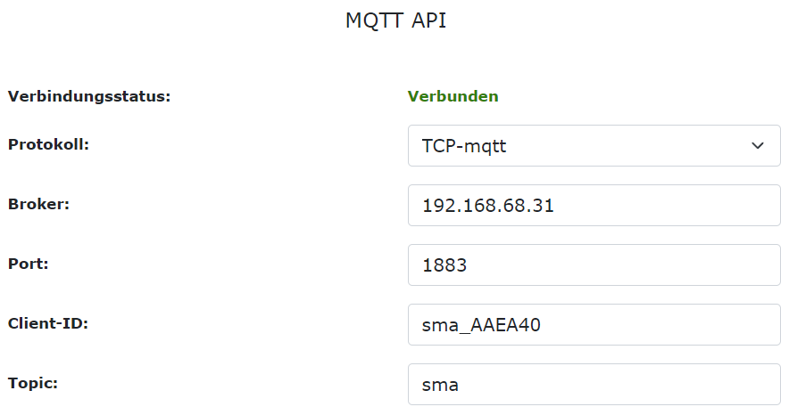

# Real-time data processing with Apache Kafka

Implementation of a real-time energy data streaming system from Austrian Smart Meter Adapter to a centralized service. This project was implemented as part of the Software Architectures and Patterns course at FH Hagenberg.

## Prerequisites
### MQTT

#### Install Mosquitto MQTT Broker

```bash
$ sudo apt install mosquitto mosquitto-clients
```

#### Start Broker

```bash
$ mosquitto -c mosquitto.conf
```

#### Setup MQTT connection on  Smart Meter Adapter

Smart Meter Adapter publishes measurements on MQTT Broker. Replace the IP address with your own.



### Kafka

#### Get Kafka

```bash
$ curl "https://downloads.apache.org/kafka/3.6.1/kafka_2.13-3.6.1.tgz" | tar -xzf -
$ cd kafka_2.13-3.6.1
```

#### Start Kafka with KRaft

Generate a Cluster UUID
```bash
$ KAFKA_CLUSTER_ID="$(bin/kafka-storage.sh random-uuid)"
```

Format Log Directories
```bash
$ bin/kafka-storage.sh format -t $KAFKA_CLUSTER_ID -c config/kraft/server.properties
```

Start the Kafka Server
```bash
$ bin/kafka-server-start.sh config/kraft/server.properties
```

### Libraries

Install the following libraries with Maven:

- org.apache.kafka:kafka-clients
- org.json:json
- org.eclipse.paho:org.eclipse.paho.client.mqttv3

## Start Program

Open the project with an IDE (IntelliJ was used for the development).

### Producer - src/producer

Start **ProducerMain**

- **SmaMqttConsumer** subscribes to MQTT topic "sma"
- **SmaKafkaProducer** writes events to Kafka


### Consumer - src/consumer

Start **ConsumerMain**

- **SmaKafkaConsumer** reads events from Kafka